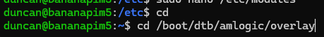
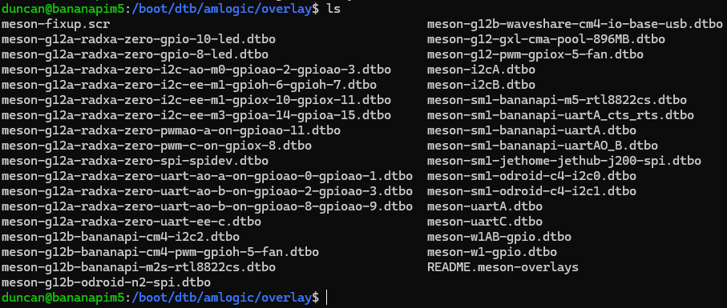
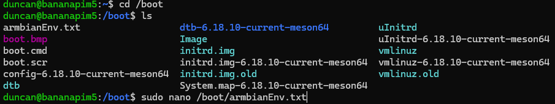
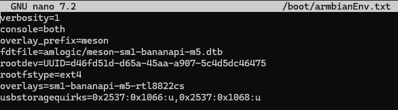
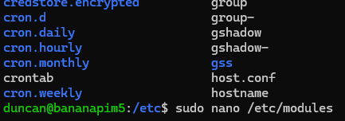
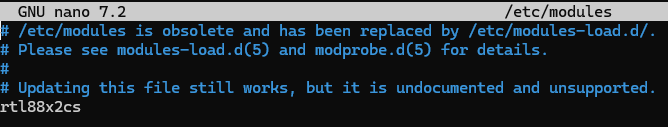

# Banana Pi M5: Armbian WiFi Setup Guide: Specifically for the RTL8822CS SDIO Board
As the internet resources are few and far between I tinkered around until I had something working and would like to leave somewhere more centralised that I can share my successes without having to sign up for a forum membership. Using these steps I was able to get WiFi up and running in the latest Armbian build, 26.2.1, for the Banana Pi M5. Just as with the distros from Sinovoip, the driver overlays are there but they are not activated by default.
  
**We start with the driver overlays and where they're stored in Armbian**  
------------------------  

------------------------  
**Doing a directory listing we see the** ***meson-sm1-bananapi-m5-rtl8822cs.dtbo***
------------------------  

------------------------
**Starting with modifying armbianEnv.txt to add in the overlay we have to make sure to factor in the overlay_prefix into our dtbo. This replaces the step for editing /boot/boot.ini on any of the distros provided by Sinovoip** 
------------------------  

------------------------
**We insert a new line for** ***overlay=sm1-bananapi-m5-rtl8822cs*** **and the overlay_prefix will appropriately add meson in front when it comes to load the dtbo on boot**  
------------------------ 

------------------------
**From here we need to edit modules**  
------------------------ 

------------------------
**Adding in the line** ***rtl88x2cs*** **this part is inline with the instructions from Sinovoip**  
------------------------ 

